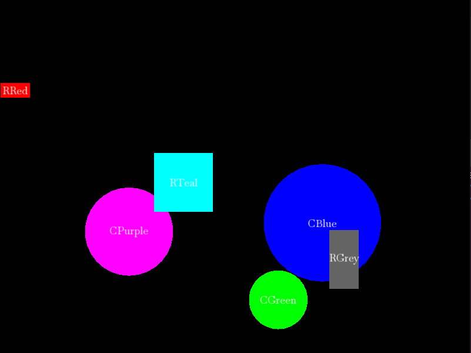

# Screensaver

This project is screensaver desktop application (check out screenshots bellow). 

This project uses:
- c++
- SFML
- gcc

# How to build and run project

Note, you need SFML to run this project.

First, compile main:

```
$ g++ -c main.cpp
```

Second, link main with libraries and create executable:

```
$ g++ main.o -o screensaver -lsfml-graphics -lsfml-window -lsfml-system
```

Finally, run it:

```
$ ./screensaver
```

# Screenshots





